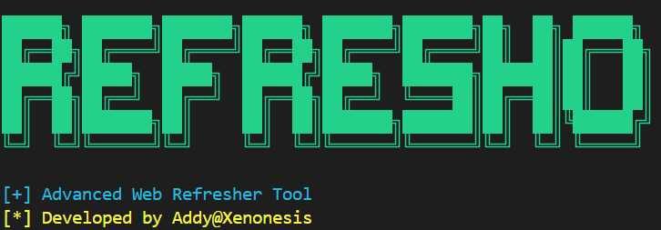

# Development Guide for REFRESHO

This guide covers everything you need to know to start developing REFRESHO.

## Table of Contents
- [Development Environment Setup](#development-environment-setup)
- [Project Architecture](#project-architecture)
- [Code Organization](#code-organization)
- [Development Workflow](#development-workflow)
- [Testing](#testing)
- [Debugging](#debugging)
- [Performance Optimization](#performance-optimization)

## Development Environment Setup

### Prerequisites
- Python 3.9 or higher
- Git
- Chrome Browser
- Visual Studio Code (recommended)

### Step-by-Step Setup
1. **Clone Repository**
   ```bash
   git clone https://github.com/Xenonesis/Refresho.git
   cd Refresho
   ```

2. **Create Virtual Environment**
   ```bash
   python -m venv venv
   # Windows
   venv\Scripts\activate
   # Unix/MacOS
   source venv/bin/activate
   ```

3. **Install Dependencies**
   ```bash
   pip install -r requirements.txt
   ```

4. **Configure IDE**
   - Install Python extension for VS Code
   - Set up linting (flake8)
   - Configure black formatter
   - Set up pytest integration

## Project Architecture

### Core Components
```
.
├── assets/
│   └── rf.png
├── docs/
│   ├── CHANGELOG.md
│   ├── CONTRIBUTING.md
│   ├── DEVELOPMENT.md
│   ├── FIX_SUMMARY.md
│   ├── SITE_INTELLIGENCE_FEATURE.md
│   ├── TROUBLESHOOTING.md
│   └── URL_MANAGEMENT_UPDATE.md
├── history/
├── reports/
├── saved_urls/
├── scripts/
│   ├── install_dependencies.bat
│   └── run_refresh_bot.bat
├── src/
│   ├── demo_url_selection.py
│   ├── manage_urls.py
│   ├── refresh_bot.py
│   └── view_history.py
├── tests/
│   ├── test.py
│   ├── test_refresh_bot.py
│   └── test_vapt.py
├── .gitignore
├── .roomodes
├── README.md
└── requirements.txt
```

### Key Classes and Their Responsibilities

1. **Main Functions (e.g., main, refresho_beast, get_advanced_config)**
   - Application entry point and core workflow control
   - Handles user interaction and configuration
   - Orchestrates the use of other classes/functions

2. **URLManager Class**
   - Handles loading, saving, adding, and removing URLs
   - Manages persistent storage of saved URLs

3. **SiteAnalyzer Class**
   - Performs comprehensive site analysis (performance, content, tech, security)
   - Displays and saves analysis reports

4. **VAPTAnalyzer Class**
   - Performs vulnerability assessment checks (headers, sensitive files, ports)
   - Displays and saves VAPT results

5. **HackerEffects Class**
   - Provides visual effects for the terminal UI

6. **SystemAnalyzer Class**
   - Gathers system information

## Code Organization

### Coding Standards
- Follow PEP 8
- Use type hints
- Maximum line length: 80 characters
- Comprehensive docstrings
- Clear variable naming

### Example Class Structure
```python
from typing import List, Optional

class ComponentName:
    """
    Component description.

    Attributes:
        attr1: Description
        attr2: Description
    """

    def __init__(self, param1: str, param2: Optional[int] = None) -> None:
        """
        Initialize component.

        Args:
            param1: Description
            param2: Description
        """
        self.param1 = param1
        self.param2 = param2

    def method_name(self, input_data: List[str]) -> bool:
        """
        Method description.

        Args:
            input_data: Description

        Returns:
            Description of return value

        Raises:
            ErrorType: Description of error condition
        """
        # Implementation
        pass
```

## Development Workflow

### 1. Feature Development
1. Create feature branch
2. Implement changes
3. Write tests
4. Update documentation
5. Submit PR

### 2. Code Review Process
1. Self-review changes
2. Request review
3. Address feedback
4. Update PR
5. Merge when approved

### 3. Version Control Guidelines
- Meaningful commit messages
- Regular small commits
- Keep branches updated
- Clean commit history

## Testing

### Test Structure (using unittest)
```python
import unittest
from unittest.mock import patch, MagicMock
# Import classes/functions from src/refresh_bot to test
from src.refresh_bot import URLManager, SiteAnalyzer, VAPTAnalyzer, create_chrome_driver

class TestComponentName(unittest.TestCase): # Example Test Class
    """Test suite for ComponentName"""

    def test_method_name(self):
        """Test method_name functionality"""
        # Arrange
        # Mock dependencies if necessary
        
        # Act
        # Call the method being tested
        
        # Assert
        # Use assert methods to verify results
        pass
```

### Running Tests
```bash
# Run the comprehensive test suite
python -m unittest tests/test_refresh_bot.py -v
```

## Debugging

### Tools and Techniques
1. **VS Code Debugger**
   - Set breakpoints
   - Watch variables
   - Step through code

2. **Logging**
   ```python
   import logging

   logging.debug("Debug message")
   logging.info("Info message")
   logging.error("Error message")
   ```

3. **Browser Developer Tools**
   - Network monitoring
   - Console logs
   - Element inspection

## Performance Optimization

### Guidelines
1. **Memory Management**
   - Clean up resources
   - Use context managers
   - Monitor memory usage

2. **Speed Optimization**
   - Profile code
   - Cache results
   - Optimize loops

3. **Resource Usage**
   - Efficient data structures
   - Connection pooling
   - Resource cleanup

### Profiling
```python
import cProfile
import pstats

def profile_function():
    profiler = cProfile.Profile()
    profiler.enable()
    # Code to profile
    profiler.disable()
    stats = pstats.Stats(profiler).sort_stats('cumulative')
    stats.print_stats()
```

## Questions and Support

- Create issues for questions
- Join developer discussions
- Contact maintainers
- Review existing documentation

Happy coding! 🚀